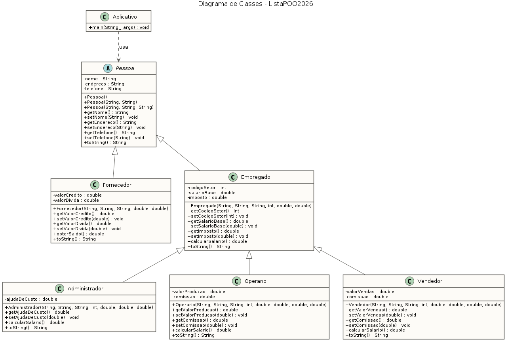

# ListaPOO2026 — Herança e Polimorfismo em Java

Projeto acadêmico da disciplina de Programação Orientada a Objetos (IFG), implementando uma hierarquia de classes para cadastro de pessoas, fornecedores e empregados com cálculo polimórfico de salários.

## Diagrama de classes



*Diagrama gerado com [PlantUML](https://plantuml.com) — fonte em [`docs/ListaPOO2026.puml`](docs/ListaPOO2026.puml).*

## Estrutura

A hierarquia parte da classe abstrata `Pessoa` e se ramifica em dois níveis:

```
Pessoa (abstrata)
├── Fornecedor            → obterSaldo(): crédito − dívida
└── Empregado             → calcularSalario(): salário base − imposto
    ├── Administrador     → redefine: + ajuda de custo
    ├── Operario          → redefine: + comissão sobre produção
    └── Vendedor          → redefine: + comissão sobre vendas
```

## Conceitos de POO aplicados

| Conceito | Onde aparece |
|---|---|
| **Abstração** | `Pessoa` é abstrata: define o contrato comum sem permitir instância direta |
| **Encapsulamento** | Todos os atributos `private`, acesso via seletores (getters) e modificadores (setters) |
| **Herança** | Dois níveis: `Pessoa → Empregado → Administrador/Operario/Vendedor` |
| **Polimorfismo** | `calcularSalario()` redefinido em 3 subclasses; teste com `Pessoa[]` e ligação dinâmica |
| **Reuso via `super`** | Construtores encadeados com `super(...)`; subclasses reaproveitam `super.calcularSalario()` e `super.toString()` |
| **Sobrecarga** | `Pessoa` oferece três construtores com assinaturas diferentes |

Destaques de implementação:

- O desconto de imposto é calculado **uma única vez**, em `Empregado.calcularSalario()`; cada subclasse chama `super.calcularSalario()` e soma apenas seu adicional — sem duplicação de regra de negócio.
- Os `toString()` são encadeados pela hierarquia (`super.toString()` + campos próprios), de modo que cada objeto imprime sua ficha completa.
- O programa de teste (`Aplicativo`) percorre um único `Pessoa[]` contendo os cinco tipos concretos — a saída correta de cada salário demonstra a ligação dinâmica em ação.

## Exemplo de saída

```
----LISTA DE PESSOAS----

Nome: Beltrano
Endereço: Rua Vila do chaves
Telefone: 454-545-454
Codigo Setor: 8
Salario Base: 1800.0
Impostos: 27.0%
Salario Líquido: 1664.0
Ajuda de Custo: 350.0

Nome: Astrogildo
Endereço: rua centro
Telefone: 232-233-233
Codigo Setor: 6
Salario Base: 1000.0
Impostos: 27.0%
Salario Líquido: 1230.0
Comissão: 500.0
```

## Como executar

Requisitos: JDK 11 ou superior.

```bash
cd src
javac Pessoa/*.java Aplicativo/*.java
java Aplicativo.Aplicativo
```

Ou importe o projeto no Eclipse (`File → Import → Existing Projects into Workspace`) e execute `Aplicativo.java`.

## Organização do repositório

```
ListaPOO2026/
├── src/
│   ├── Pessoa/        # Hierarquia de classes do domínio
│   └── Aplicativo/    # Programa de teste polimórfico
├── docs/              # Diagrama UML (fonte .puml + imagens)
└── README.md
```

---

Desenvolvido por [Kleber](https://github.com/KleberCS84) — disciplina de POO, Bacharelado em Ciência da Computação (IFG).
